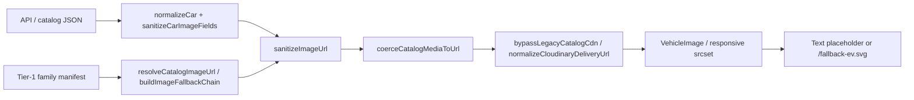

# Catalog media governance (Alpha Platform Stable v1)

Governed image delivery for EVSavari buyer surfaces: homepage, listing, compare, and vehicle detail.

## Image lifecycle



1. **Ingest** — OEM or ops uploads to Cloudinary under `evsavari/catalog/families/{family-slug}/` (extensionless public IDs: `hero`, `listing-thumb`, `compare-thumb`, `og`).
2. **API fields** — `heroImage`, `listingThumbnail`, `compareThumbnail`, `image`, `ogImage` on vehicle documents.
3. **Normalize** — `normalizeCar()` runs `sanitizeCarImageFields()` on every catalog row.
4. **Resolve by role** — `resolveCatalogImageUrl(car, role)` picks the best URL for compare / listing / hero / og.
5. **Render** — `VehicleImage` is the single interactive renderer (lazy load, shimmer, error handling).
6. **Fallback** — Missing or blocked URLs show the in-component placeholder (“EV image coming soon”) or local SVG; **no request** to dead hosts.

## Cloudinary pipeline

| Constant | Value |
|----------|--------|
| Cloud name | `dznvmumze` (override: `VITE_CLOUDINARY_CLOUD_NAME`) |
| Folder prefix | `evsavari/catalog` (not the cloud name) |
| Delivery base | `https://res.cloudinary.com/{cloud}/image/upload/` |

**Builders** (`src/media/cloudinary.js`):

- `cloudinaryDeliveryUrl(publicId)` — canonical delivery URL with transforms.
- `familyCatalogAssetUrl(family, basename)` — tier-1 families only (`productionFamilies.js`).
- `normalizeCloudinaryDeliveryUrl(url)` — fixes wrong cloud segment (`evsavari` → `dznvmumze`), strips erroneous `.jpg` on role tokens.

## CDN migration strategy (temporary stabilization)

**Legacy host:** `cdn.evsavari.com` — **offline**; must not reach the browser.

**Policy:**

1. `bypassLegacyCatalogCdn(url)` rewrites `https://cdn.evsavari.com/catalog/...` → Cloudinary delivery when path maps to a public ID.
2. Unmappable CDN paths (`/_fallbacks/`, unknown paths) return `null` (no network request).
3. `isLegacyCatalogCdnUrl()` — used in `isValidImageUrl`, `sanitizeImageUrl`, `VehicleImage`, and `responsive.js` as a hard block.
4. **Do not** add new URLs pointing at `cdn.evsavari.com`.

**Path mapping:**

```
https://cdn.evsavari.com/catalog/families/mg-comet-ev/listing-thumb
  → https://res.cloudinary.com/dznvmumze/image/upload/.../evsavari/catalog/families/mg-comet-ev/listing-thumb
```

## Sanitization rules

**Entry point:** `sanitizeImageUrl(url)` in `src/utils/imageUrl.js`.

| Check | Behavior |
|-------|----------|
| Bare tokens (`hero`, `compare-thumb`, `hero.jpg`, …) | Rejected (strict equality via `BARE_INVALID_IMAGE_VALUES`) |
| Legacy CDN host | Rewritten via `bypassLegacyCatalogCdn`; rejected if still present |
| Non–tier-1 `/hero` Cloudinary paths | Blocked on compare; blocked globally for non-production families |
| Speculative `/catalog/variants/` URLs | Not requested at runtime |
| Invalid / empty | `null` |

**Required:** All user-visible `src` values go through `sanitizeImageUrl` or `VehicleImage` (which sanitizes internally). Exceptions fixed in v1 audit: `UpcomingCarCard` now sanitizes; raw `` must not use API strings directly.

## Responsive image policy

**Module:** `src/media/responsive.js`

- `buildResponsiveSources` / `buildSrcSet` call `responsiveDeliveryUrl()` → `bypassLegacyCatalogCdn` before building srcset.
- Non-Cloudinary URLs after bypass return **empty** srcset (no dead CDN in `<picture>`).
- Transforms via `applyCloudinaryTransforms` (width, format avif/webp).

**Roles and sizes** (`VehicleImage`): `listing`, `compare`, `hero`, `gallery`, `og` — see `SIZES_BY_ROLE` in `VehicleImage.jsx`.

## Placeholder strategy

| Surface | Missing image behavior |
|---------|-------------------------|
| Compare cards | Text placeholder in `VehicleImage` (`role="compare"`); no fallback chain to `LOCAL_FALLBACK_EV` on error |
| Listing / homepage cards | `buildImageFallbackChain` → tier-1 manifest → `/fallback-ev.svg` |
| Detail hero / gallery | `getSafeImage()` → sanitize → SVG fallback |
| Upcoming (static) | `sanitizeImageUrl` → `LOCAL_FALLBACK_EV` on error |

## Role → field priority

**Compare** (`resolveCatalogImageUrl`, `role: "compare"`):

1. `compareThumbnail` (API + meta)
2. `image`, `listingThumbnail`
3. `heroImage` (API; Cloudinary `/hero` allowed for tier-1 only)
4. Tier-1 manifest: `compare-thumb` → `listing-thumb` → `hero`

**Listing / homepage cards:** `role: "listing"` on `CompactCarCard` / `CarCard`.

**Detail:** `role: "hero"` + `role: "gallery"` on `DetailHero`.

## Media policy (2026-05-20)

See **[docs/catalog/media-policy.md](../../catalog/media-policy.md)**.

| Tier | Families | Rule |
|------|----------|------|
| Legacy frozen | `tata-nexon-ev`, `tata-punch-ev` | Keep existing Cloudinary assets; do not replace during productionization |
| Licensed standard | All other families + future EVs | Wikimedia Commons or explicitly licensed sources; attribution in `tier1-media-attribution.json`; deliver via Cloudinary only |

Prohibited: OEM website hotlinks, Google Images, third-party automotive portals.

## Licensed media ingestion standards

1. Record attribution in `docs/operations/tier1-media-attribution.json` (source page, creator, license, credit text).
2. Register approved ingest URL in `docs/operations/tier1-cloudinary-seed.json`.
3. Run `npm run media:attribution-audit` then `npm run media:upload-tier1`.
4. Upload to Cloudinary folder `evsavari/catalog/families/{canonical-family-slug}/`.
5. Use extensionless asset names: `hero`, `listing-thumb`, `compare-thumb`, `og`.
6. Register family in `PRODUCTION_FAMILY_SLUGS` only when all required assets exist.
7. API must not store bare role strings (`hero`, `compare-thumb`) as URLs.
8. Prefer HTTPS `res.cloudinary.com` URLs in API responses; CDN host is rewritten at runtime until fully purged from DB.

## API interaction (no image impact)

Catalog fetches use `safeFetchJson` / `safeFetchJsonWithRetry` with 15–20s timeout. Failed requests are logged via `logApiRequest` (deduped in production). Cold-start copy is surfaced on homepage and detail when `isLikelyApiColdStart()` is true.

## Audit checklist (release gate)

- [ ] DevTools Network: zero requests to `cdn.evsavari.com`
- [ ] No 404 on bare `hero`, `compare-thumb.jpg`, or `listing-thumb.jpg` as path segments
- [ ] Compare guide: MG Comet (tier-1) image loads; non–tier-1 shows placeholder without 404
- [ ] Homepage sections do not show “No EVs Found” when API error banner is visible
- [ ] `npm run build` clean

## Key files

| File | Responsibility |
|------|----------------|
| `src/media/cloudinary.js` | Delivery URLs, CDN bypass, blocks |
| `src/utils/imageUrl.js` | `sanitizeImageUrl`, bare token guards |
| `src/utils/vehicleMedia.js` | Role resolution, fallback chains |
| `src/media/responsive.js` | Srcset / picture |
| `src/components/media/VehicleImage.jsx` | Render, lazy load, placeholders |
| `src/media/familyMediaManifest.js` | Tier-1 Cloudinary manifest |
| `src/config/media.js` | Cloud name, `LEGACY_CATALOG_CDN_HOST` |
