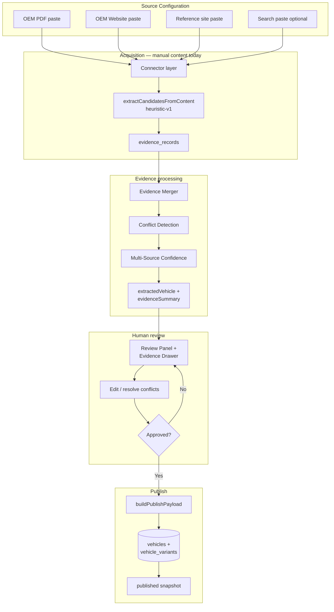

# Catalog Acquisition Readiness Audit

**Audit date:** 8 June 2026  
**Scope:** Catalog Acquisition System v1 + Multi-Source Evidence Engine v2  
**Method:** Code-path review only — no production changes, no live Supabase inspection  
**Auditor role:** Readiness assessment for scaling EVSavari catalog operations

---

## Executive Summary

EVSavari has a **solid architectural foundation** for catalog acquisition: an admin import wizard, multi-source evidence infrastructure, conflict detection, human review gates, snapshot storage, and a guarded publish pipeline. The v2 evidence engine correctly models source trust, field-level provenance, and merge/confidence logic.

However, the system is **not ready for large-scale, near-autonomous catalog onboarding today**. Extraction remains almost entirely **heuristic/regex-based**, source acquisition is **manual** (paste HTML/text; no automated fetch in the v2 path), and the publish payload covers only a **narrow subset** of fields required for production-quality vehicle pages (verified dossiers remain a separate, hand-curated path for Tata Nexon/Punch/Tiago).

| Dimension | Assessment |
|-----------|------------|
| Workflow & governance | Strong — mandatory review + approval before publish |
| Multi-source evidence (v2) | Implemented in code; infrastructure-ready |
| Extraction quality | Weak — regex heuristics, hardcoded brand/model lists |
| Source automation | Minimal — manual paste; CORS blocks browser fetch |
| Catalog completeness vs production | Low — ~19 scalar fields; no media, features, real-world range |
| Scalability (50+ models) | Constrained by manual review and heuristic maintenance |

### Final Recommendation

**Partially ready** for catalog growth.

- **Yes** for controlled, ops-led onboarding of simple vehicle records with mandatory human review and low completeness expectations.
- **No** for the stated north star: *“Upload brochure + OEM URL → review → publish in under 5 minutes”* at production catalog quality across 100+ models.

Supporting rationale appears in Sections 2, 6, 8, and 10.

---

## Section 1: Current Workflow Analysis

### 1.1 End-to-end onboarding workflow

#### Import sources (verified)

| Source | Entry point | Trust score | Automation |
|--------|-------------|-------------|------------|
| OEM PDF | Wizard step 1 + step 2 paste | 100 | Manual — file read as text via `FileReader`; no PDF parser |
| OEM Website | Wizard URL + step 2 paste | 95 | Manual paste; optional browser fetch in v1 legacy path only |
| Trusted references (CarDekho, ZigWheels, CarWale) | Wizard URL list + step 2 paste | 80 | Manual paste; allowlist in `trustedReferenceSources.js` |
| Search results | Optional wizard field + paste | 60 | Manual paste; scoped to missing fields only |
| Legacy single-source (v1) | Checkbox in wizard | N/A | Same heuristics; one content blob |
| Server CLI (v1 only) | `scripts/catalog-import-process.mjs --url=...` | N/A | Automated URL fetch; **does not run v2 evidence pipeline** |
| Legacy CSV/JSON | `/admin/catalog-ingestion` | N/A | Separate ingestion system; not part of catalog acquisition wizard |

**Code references:**
- Wizard: `src/pages/admin/CatalogImportWizardPage.jsx`
- v2 API: `apiAcquireEvidence()` in `src/services/catalogImportApi.js`
- v1 API: `apiExtractAndNormalize()` in same file
- Connectors: `src/catalogAcquisition/connectors/`
- Pipeline: `runEvidencePipeline()` in `src/catalogAcquisition/evidencePipeline.js`

#### Extraction flow (verified)

All connectors (`PdfConnector`, `OemWebsiteConnector`, `ReferenceSiteConnector`, `SearchConnector`) delegate to `BaseConnector.extractRecordsFromContent()`, which calls:

1. `extractCandidatesFromContent()` — regex/heuristic extraction (`extractFromText.js`)
2. `candidatesToEvidenceRecords()` — maps candidates → evidence records (`evidenceRecord.js`)

There is an `extractWithAiProvider()` hook in `extractFromText.js`, but **it is never invoked** by the wizard, API, connectors, or CLI script.

#### Evidence flow (verified — v2)

```
Source inputs (paste content per source)
    → acquireEvidenceFromSources() [connectors/index.js]
    → evidence_records (Supabase or localStorage fallback)
    → mergeAllEvidence() [evidenceMerger.js]
    → detectFieldConflict() [conflictDetection.js]
    → computeMultiSourceConfidence() [multiSourceConfidence.js]
    → mergedFieldsToExtractionDraft() → extractedVehicle + evidenceSummary
    → status: review_required
```

Persisted via `apiAcquireEvidence()` → `replaceEvidenceRecords()` + `updateCatalogImport()`.

#### Review flow (verified)

1. Admin opens `/admin/catalog/import`
2. `CatalogImportReviewPanel` shows merged values, confidence badges, conflict highlights
3. `EvidenceDrawer` shows per-field sources, trust levels, conflict resolution
4. Admin edits fields inline; can resolve conflicts via `apiResolveFieldConflict()`
5. Approve → `apiApproveImport()` sets status `approved`, writes `reviewed` snapshot
6. Reject → status `rejected`

**Gate:** `publishCatalogImport()` rejects publish unless status is `approved` (`publishImport.js:135-139`).

#### Publish flow (verified)

```
approved import
    → buildPublishPayload(reviewedVehicle)
    → upsertVehicle() + upsertVehicleVariant() [vehicleService.js]
    → status: published
    → published snapshot recorded
```

Publish writes: vehicle slug/brand/name/category, `chargingMeta`, nested `metadata` (safety, dimensions, performance), and variant price/range/battery/specs. **Does not write `vehicle_media` or verified-dossier-level detail.**

### 1.2 Workflow diagram



### 1.3 Status lifecycle (verified)

`draft` → `processing` (unused in current wizard) → `review_required` → `approved` → `published` | `rejected`

Defined in `src/catalogAcquisition/constants.js` (`IMPORT_STATUS`).

---

## Section 2: New Vehicle Onboarding Assessment

**Question:** Can a completely new EV model be onboarded today using the current system?

**Answer:** **Partially.** A minimal vehicle + variant record can be created and published if an operator manually supplies source text, reviews extracted fields, and accepts low catalog completeness. Production-quality pages matching verified dossier depth **cannot** be achieved through catalog acquisition alone.

| Area | Status | Explanation (evidence-based) |
|------|--------|------------------------------|
| **Vehicle creation** | Semi-Automated | `buildPublishPayload()` creates vehicle when `familySlug`, `brand`, `model` are present (`publishImport.js:33-37`). Slug derived via `slugify()` in `normalizeExtracted.js:12-17`. Fails if regex misses brand/model. |
| **Variant creation** | Semi-Automated / Manual | Variants extracted only when `variant\|trim:` patterns match (`extractFromText.js:102-113`). Otherwise a single **"Base"** variant is published (`publishImport.js:103-121`). No trim matrix or configurator parsing. |
| **Specification population** | Semi-Automated | 19 scalar fields in `EVIDENCE_FIELD_NAMES` / `EXTRACTION_FIELD_GROUPS`. Populated when regex hits; many fields often empty on real OEM pages. |
| **Pricing population** | Semi-Automated | `startingPrice` = min, `topVariantPrice` = max of all INR matches in document (`extractFromText.js:63-71`). Risk of capturing wrong numbers (EMI, lease, accessories). Per-variant pricing weakly tied to variant index. |
| **Feature population** | Manual | No feature schema in extraction. `adas` is boolean regex only (`extractFromText.js:99`). Verified dossiers include ADAS feature objects, comfort, infotainment — not acquirable today. |
| **Media population** | Manual | No media connector or publish path. Verified dossiers use `TATA_*_FAMILY_MEDIA` Cloudinary URLs (`tataNexonEvVerified.js:14-20`). `publishImport.js` does not call `upsertVehicleMedia`. |

### Verified vs production catalog path

Production-quality Tata families use **verified dossier overlays** (`src/data/catalog/verified/`), generated from Excel workbooks via dedicated scripts — **outside** the catalog acquisition wizard. Only 3 families have verified dossiers today (Nexon EV, Punch EV, Tiago EV).

---

## Section 3: Auto-Population Coverage

Estimates reflect **realistic hit rates** for a net-new Indian-market EV using OEM PDF + website + one reference site, given current regex extraction. Percentages are **assumptions/estimates** unless marked verified.

| Field Category | Examples | Auto-populated % | Manual % | Source Coverage | Confidence Quality |
|----------------|----------|------------------|----------|-----------------|-------------------|
| **Vehicle** | brand, model, bodyType, familySlug | 40–60% | 40–60% | OEM PDF, OEM web, references | Medium — hardcoded brand/model fallback lists (`extractFromText.js:48-56`) |
| **Pricing** | startingPrice, topVariantPrice | 30–50% | 50–70% | References often have price; OEM PDF may omit | Low–Medium — min/max heuristic; false price capture risk |
| **Battery** | batteryCapacityKwh | 50–70% | 30–50% | All source types | Medium — first `kWh` match only |
| **Range** | claimedRangeKm (ARAI) | 40–60% | 40–60% | OEM + references | Medium — first range match |
| **Charging** | acChargingKw, dcChargingKw | 35–55% | 45–65% | OEM + references | Medium — no charge times, port type, curves |
| **Performance** | powerPs, torqueNm | 30–50% | 50–70% | OEM brochures | Medium |
| **Dimensions** | length/width/height/wheelbase mm | 20–40% | 60–80% | OEM spec sheets | Low — requires explicit `length: NNNN mm` patterns |
| **Safety** | airbags, adas (bool), ncapRating | 25–45% | 55–75% | Mixed | Low — ADAS is boolean; no feature-level ADAS |
| **Features** | ventilated seats, sunroof, infotainment, connectivity | 0% | 100% | Not in schema | N/A — **verified gap** |
| **Variants** | trim names, per-trim specs | 15–30% | 70–85% | Variant regex only | Low — inherits vehicle-level battery/range |
| **Media** | hero, listing, compare images | 0% | 100% | Not in acquisition | N/A — separate media ops |

**Verified:** Schema covers 19 scalar fields (`evidenceRecord.js:8-28`).  
**Verified:** Publish payload field mapping in `publishImport.js:40-121`.  
**Assumption:** Auto-populated percentages based on regex specificity and typical OEM page structure.

---

## Section 4: Heuristic Dependency Audit

Every connector ultimately depends on `extractCandidatesFromContent()`. Normalization adds range-validated confidence scoring but does not change extracted values.

| File | Function | Purpose | Risk Level |
|------|----------|---------|------------|
| `extractFromText.js` | `stripHtml()` | Remove HTML tags/scripts before regex | **Medium** — loses table structure, spec grids |
| `extractFromText.js` | `firstMatch()` | First regex hit wins | **High** — wrong value when multiple specs (variants) |
| `extractFromText.js` | `allMatches()` | Collect all regex hits (prices, variants) | **Medium** — price array may include noise |
| `extractFromText.js` | `extractCandidatesFromContent()` | Master heuristic extractor | **High** — single point of failure for all connectors |
| `extractFromText.js` | Brand regex | `Tata\|Mahindra\|Hyundai\|...` hardcoded list | **High** — new OEMs/brands missed |
| `extractFromText.js` | Model regex | Hardcoded model names (Nexon EV, Punch EV, …) | **High** — new models missed unless generic `model:` label matches |
| `extractFromText.js` | Price regex | INR/lakh patterns, filter 300k–50M | **Medium** — false positives/negatives |
| `extractFromText.js` | Battery/range/charging regex | First numeric match | **High** — multi-variant docs |
| `extractFromText.js` | ADAS regex | Boolean keyword test | **High** — no feature granularity; false positives |
| `extractFromText.js` | Variant regex | `(?:variant\|trim):` labels | **High** — misses table-style variant listings |
| `normalizeExtracted.js` | `slugify()` | familySlug generation | **Medium** — collisions, inconsistent slugs |
| `normalizeExtracted.js` | `scoreNumeric()` / `scorePresent()` | Per-field confidence | **Low** — scoring only |
| `evidenceRecord.js` | `normalizeEvidenceValue()` | Conflict comparison normalization | **Low** — merge logic |
| `evidenceMerger.js` | `mergeEvidenceForField()` | Trust-weighted winner selection | **Low** — deterministic merge |
| `conflictDetection.js` | `detectFieldConflict()` | 25% trust-weight threshold | **Medium** — may miss subtle conflicts |
| `multiSourceConfidence.js` | `computeMultiSourceConfidence()` | Weighted confidence formula | **Low** — scoring only |
| `multiSourceConfidence.js` | `filterRecordsForMerge()` | Search cannot override OEM | **Low** — intentional guard |
| `publishImport.js` | `variantSlug()` | Variant slug from name | **Low** — slug collisions possible |

**Verified:** `extractWithAiProvider()` exists but is **not wired** — no LLM extraction in production path.

---

## Section 5: Missing Acquisition Coverage

Fields and capabilities **not reliably acquirable** today (verified against schema + publish payload + verified dossier comparison):

### Not in extraction schema at all

- Real-world range (`rangeKmRealWorld` exists on `vehicle_variants` table but never set by publish)
- Charging port type (CCS2, Type 2)
- AC/DC charge times (0–100%, 10–80%)
- Charging curve data
- Acceleration (0–100 s)
- Power in kW (only PS extracted)
- Range standard (MIDC, WLTP, ARAI label)
- Warranty (battery, vehicle, motor)
- Color options / exterior palettes
- Interior & comfort features (ventilated seats, sunroof, ambient lighting)
- Infotainment (screen size, OS, connectivity, speakers)
- Driver assistance feature matrix (FCW, AEB, LKA, etc.)
- Connected car / telematics features
- Boot space, ground clearance, kerb weight
- Seating capacity
- Drive type (FWD/RWD/AWD)

### In schema but weak/unreliable

- **ADAS** — boolean only; verified dossiers use structured `adas.features` object
- **Dimensions** — rarely extracted from typical marketing pages
- **Per-variant battery/range/charging** — variants inherit vehicle-level values
- **NCAP rating** — regex for "X star NCAP" only; Bharat NCAP structure not modeled

### Infrastructure gaps

- **Media** — no acquisition, staging, or publish integration
- **Automated URL fetch in v2** — wizard requires manual paste for all v2 sources
- **PDF parsing** — browser reads file as plain text (`CatalogImportWizardPage.jsx` `readAsText`); binary PDFs fail
- **Change detection** — snapshots stored; no diff agent implemented
- **Batch onboarding** — one import at a time via wizard
- **Server-side v2 pipeline** — `catalog-import-process.mjs` uses v1 only

---

## Section 6: Human Effort Analysis

All figures are **assumptions/estimates** for a trained catalog operator with OEM PDF + website + one reference URL available. Times exclude waiting on external stakeholders.

| Task | Estimated effort | Assumptions |
|------|------------------|-------------|
| **New vehicle (minimal publish)** | 45–90 min | Copy-paste 2–4 source texts; review ~19 fields; resolve 1–3 conflicts; approve + publish. Minimal variant = 1 "Base" trim. |
| **New vehicle (multi-variant, usable compare)** | 3–6 hours | Manual variant entry/editing; per-trim price/spec correction; media uploaded separately via media ops; verified-dossier quality requires parallel manual dossier work. |
| **New variant** | 30–60 min | No variant-specific extraction; operator adds/edits in review UI or post-publish in Supabase/legacy tools. |
| **Price change** | 15–30 min | Re-run import or manual edit; no change-detection agent; full review cycle if using wizard. |
| **Feature change** | 45–120 min | Features not in acquisition schema; manual update in dossier, metadata, or editorial content outside wizard. |

**Verified:** Wizard requires manual content entry for v2 (`CatalogImportWizardPage.jsx` step 2 textareas).  
**Verified:** Approve + publish are separate explicit actions.

---

## Section 7: Accuracy Risk Assessment

| Risk | Description | Severity | Evidence |
|------|-------------|----------|----------|
| **False positives** | Regex captures wrong price, range, or kW from marketing copy, footnotes, or competitor mentions | **High** | `firstMatch()` + global price scan (`extractFromText.js`) |
| **False negatives** | New brand/model not in hardcoded lists; fields absent from draft | **High** | Brand/model regex lists (`extractFromText.js:48-56`) |
| **Source conflicts** | OEM vs reference disagree (e.g. DC kW 70 vs 50) | **Medium** | Detected and surfaced (`conflictDetection.js`); requires manual resolution |
| **Missing data** | Published vehicle with null specs; "Base" variant only | **High** | Fallback variant (`publishImport.js:103-121`); no completeness gate before publish |
| **Publish risks** | Incorrect data reaches `vehicles`/`vehicle_variants`; compare pages show wrong specs | **Medium–High** | Human approval required but no minimum field threshold; no post-publish validation |
| **Slug collisions** | `familySlug` / variant slug conflicts on re-import | **Medium** | `upsert` on slug (`vehicleService.js:45`) — overwrites without diff review |
| **localStorage fallback** | Dev imports not in Supabase; production parity risk | **Medium** | `catalogImportStore.js` when Supabase unconfigured |
| **Migration deployment** | v2 tables/columns may not exist in production DB | **Medium** | Migrations are files only; apply status not verified in this audit |

---

## Section 8: Scalability Assessment

| Catalog size | Readiness | Bottlenecks |
|--------------|-----------|-------------|
| **25 models** | Feasible with dedicated ops | Manual paste + review per model; heuristic tuning for new OEM formats |
| **50 models** | Strained | Review workload ~40–75 hours cumulative onboarding; regex maintenance burden |
| **100 models** | Not scalable without investment | No batch pipeline; no automated fetch; variant/media manual |
| **250 models** | Not ready | Heuristic brittleness; conflict review volume; no monitoring/change agents |
| **500 models** | Not ready | All above + publish QA, media coverage, dossier parity gaps |

### Primary bottlenecks (verified)

1. **Review workload** — every import requires human field review and explicit approval; no auto-approve path.
2. **Source acquisition** — manual copy-paste for all v2 connectors; browser CORS blocks `apiFetchSourceContent()` for most OEM domains.
3. **Heuristic maintenance** — single extractor shared by all connectors; OEM-specific formats require code changes.
4. **Publish workflow** — single-threaded wizard UI; no queue, assignment, or SLA tracking.
5. **Catalog completeness gap** — acquisition output ≠ production dossier; parallel manual work required for quality.
6. **Database ops** — migrations `003` + `004` must be applied; evidence persistence skipped in localStorage mode.

---

## Section 9: Automation Scorecard

Scores out of 100. **Current** = as implemented today. **Target** = required for near-autonomous ops at scale.

| Category | Current | Target | Notes |
|----------|---------|--------|-------|
| **Source Acquisition** | 15 | 85 | Manual paste; CLI fetch v1-only; no PDF parser |
| **Extraction** | 25 | 90 | Regex heuristics; AI hook unused |
| **Normalization** | 55 | 85 | Schema mapping + confidence exist; limited field set |
| **Conflict Detection** | 70 | 85 | v2 merger/conflict/drawer implemented |
| **Review Workflow** | 50 | 75 | Good UI; no queue, assignment, or completeness gates |
| **Publishing** | 45 | 80 | Guarded publish works; narrow payload; no media |
| **Maintainability** | 40 | 80 | Pluggable connectors; but all share one extractor |
| **Scalability** | 20 | 85 | No batch, agents, or monitoring |
| **Overall (weighted avg.)** | **~35** | **~83** | Weighted toward extraction + source acquisition |

---

## Section 10: Gap Analysis — Path to 90% Automation

**North star:** *Upload brochure + OEM URL → review → publish in under 5 minutes*

### High-impact blockers

| Blocker | Impact | Evidence |
|---------|--------|----------|
| No automated source fetch in v2 wizard | Cannot start from URL alone | `apiAcquireEvidence()` expects pre-pasted `content`; no fetch step |
| Regex-only extraction (`heuristic-v1`) | Low recall/precision on real OEM pages | All connectors → `extractCandidatesFromContent()` |
| No PDF binary parsing | Brochure upload ineffective for real PDFs | `readAsText` on PDF file |
| Narrow publish schema vs production catalog | Publish ≠ production-ready page | Compare `publishImport.js` vs `tataNexonEvVerified.js` |
| No media acquisition | Vehicle pages incomplete after publish | No media in acquisition path |
| Weak variant modeling | Multi-trim vehicles require heavy manual work | Variant regex + inherit vehicle specs |

### Medium-impact blockers

| Blocker | Impact |
|---------|--------|
| AI extraction hook not integrated | `extractWithAiProvider()` unused |
| No server-side v2 CLI/batch job | Ops cannot script multi-source imports |
| No minimum completeness gate before publish | Incomplete records can go live |
| Migrations may be unapplied in production | v2 evidence persistence fails silently → localStorage |
| No change-detection / monitoring agents | Price/spec updates require full re-import |

### Low-impact blockers

| Blocker | Impact |
|---------|--------|
| Search connector requires manual paste | Low trust; marginal fill for missing fields |
| Trusted reference allowlist is static (3 sites) | Expanding references requires code change |
| `processing` status unused | Minor workflow clarity |

---

## Section 11: Recommended Roadmap

Prioritized initiatives to move from **~35 → ~80+** automation score.

### 1. AI Extraction Engine (LLM structured extraction)

| | |
|--|--|
| **Expected effort** | 3–5 weeks |
| **Expected ROI** | High — replaces regex for brand/model/variants/specs; unlocks 5-min review target |
| **Dependencies** | Wire `extractWithAiProvider()` or new `AiExtractionConnector`; prompt/schema alignment with `extractionSchema.js`; cost/latency controls |
| **Priority** | **P0** |

### 2. Automated Source Acquisition Service

| | |
|--|--|
| **Expected effort** | 2–4 weeks |
| **Expected ROI** | High — eliminate manual paste; enable URL-only wizard |
| **Dependencies** | Server-side fetch (extend `catalog-import-process.mjs`); PDF parser (pdf.js or cloud OCR); store raw snapshots; pass content to v2 pipeline |
| **Priority** | **P0** |

### 3. Variant & Pricing Extraction Agent

| | |
|--|--|
| **Expected effort** | 3–4 weeks |
| **Expected ROI** | High — multi-trim vehicles are core catalog need |
| **Dependencies** | AI extraction; variant-aware schema; per-variant evidence records |
| **Priority** | **P1** |

### 4. Media Acquisition Automation

| | |
|--|--|
| **Expected effort** | 2–3 weeks |
| **Expected ROI** | Medium–High — blocks production-quality pages |
| **Dependencies** | OEM media URL extraction; Cloudinary staging; integrate `upsertVehicleMedia` into publish |
| **Priority** | **P1** |

### 5. Change Detection Agent

| | |
|--|--|
| **Expected effort** | 3–4 weeks |
| **Expected ROI** | Medium — reduces ongoing ops for price/spec updates |
| **Dependencies** | Snapshot diff (`catalog_import_snapshots`); scheduled re-fetch; review tasks |
| **Priority** | **P2** |

### 6. Monitoring Agent (OEM/reference watch)

| | |
|--|--|
| **Expected effort** | 4–6 weeks |
| **Expected ROI** | Medium — proactive drift detection at scale |
| **Dependencies** | Change detection; notification/review queue; source registry |
| **Priority** | **P2** |

### 7. Publish Completeness Gates + Batch Queue

| | |
|--|--|
| **Expected effort** | 1–2 weeks |
| **Expected ROI** | Medium — safety at scale |
| **Dependencies** | Required-field policy; block publish below threshold; import queue UI |
| **Priority** | **P2** |

### 8. Expand Feature Schema (comfort, ADAS matrix, warranty)

| | |
|--|--|
| **Expected effort** | 4–6 weeks |
| **Expected ROI** | Medium — parity with verified dossiers |
| **Dependencies** | Schema design; extraction; publish mapping; UI review groups |
| **Priority** | **P3** |

---

## Appendix A: Key Code Paths (Verified)

| Capability | Primary files |
|------------|---------------|
| Admin wizard | `src/pages/admin/CatalogImportWizardPage.jsx` |
| Review + evidence drawer | `src/components/catalogImport/CatalogImportReviewPanel.jsx`, `EvidenceDrawer.jsx` |
| Browser API | `src/services/catalogImportApi.js` |
| Evidence pipeline | `src/catalogAcquisition/evidencePipeline.js` |
| Connectors | `src/catalogAcquisition/connectors/*.js` |
| Heuristic extraction | `src/catalogAcquisition/extractFromText.js` |
| Normalization | `src/catalogAcquisition/normalizeExtracted.js` |
| Evidence merge/conflict | `evidenceMerger.js`, `conflictDetection.js`, `multiSourceConfidence.js` |
| Publish | `src/catalogAcquisition/publishImport.js` |
| Persistence | `catalogImportService.js`, `evidenceRecordService.js`, `vehicleService.js` |
| Migrations | `003_catalog_imports.sql`, `004_evidence_records.sql` |
| Smoke tests | `scripts/catalog-import-smoke.mjs` |
| Server CLI (v1) | `scripts/catalog-import-process.mjs` |
| Verified dossiers (parallel path) | `src/data/catalog/verified/` |
| Legacy ingestion | `src/intelligence/ingestion/`, `/admin/catalog-ingestion` |

---

## Appendix B: Verified Findings vs Assumptions

### Verified findings

- v1 and v2 coexist; v2 adds evidence records, merger, conflict UI, multi-source confidence
- All connectors share `extractCandidatesFromContent()` heuristics
- Publish requires `approved` status; no auto-publish
- Extraction schema: 19 scalar fields + variants array
- AI extraction hook exists but is not called
- v2 wizard requires manual content paste for every source
- PDF handling is text-read only, not binary PDF parse
- `catalog-import-process.mjs` fetches URLs server-side but runs v1 pipeline only
- Publish does not write media or real-world range
- Verified dossiers (Nexon/Punch/Tiago) are separate curated assets

### Assumptions / estimates

- Auto-population percentage table (Section 3)
- Human effort minutes (Section 6)
- Automation scorecard numeric scores (Section 9)
- Production Supabase migration apply status
- Real-world regex hit rates on unseen OEM pages
- Roadmap effort ranges (Section 11)

---

## Final Recommendation (Restated)

### Is EVSavari ready for large-scale catalog growth today?

## **Partially**

**Ready for:**
- Pilot onboarding with ops oversight
- Minimal vehicle/variant records in Supabase
- Multi-source evidence gathering when humans paste sources
- Governed publish with review and snapshots

**Not ready for:**
- Near-autonomous "brochure + URL → 5-minute publish"
- 100+ model catalog without proportional ops headcount
- Production parity with verified dossier depth (charging times, real-world range, ADAS matrix, media)
- Automated price/spec monitoring at scale

**Highest-leverage next steps:** Automated source acquisition (P0) + AI structured extraction (P0) + variant-aware schema (P1) + media publish integration (P1).
