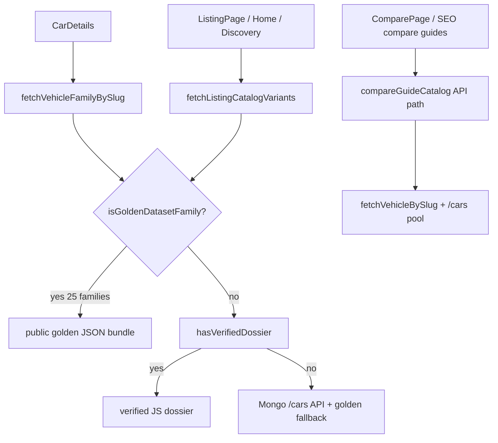

# Catalog Phase 2 — Runtime Resolver Audit

Generated: 2026-06-11T08:24:45.841Z

## Resolver precedence

### Before Phase 2

- 1. hasVerifiedDossier (Nexon, Punch, Tiago)
- 2. isGoldenDatasetFamily → bundled golden
- 3. API /cars siblings
- 4. golden async fallback
- 5. single-slug API fetch

### After Phase 2

- 1. isGoldenDatasetFamily → golden ALWAYS wins (25 manifest families)
- 2. hasVerifiedDossier (only if ∉ golden manifest)
- 3. API /cars siblings
- 4. golden async fallback
- 5. single-slug API fetch

## Runtime flow

## Summary

- Vehicles in golden manifest: **25**
- Detail/listing golden authority: **25**
- API fallback (non-manifest only): **0**
- Verified dossier bypassed (still in manifest): **3**
- Fleet source mismatches: **25**

## Per-vehicle resolution

| Family | Detail source | Listing | Compare | Golden won | Verified bypassed |
|--------|---------------|---------|---------|------------|-------------------|
| `tata-nexon-ev` | golden-dataset | golden-dataset | api-compare-guide | yes | yes |
| `tata-punch-ev` | golden-dataset | golden-dataset | api-compare-guide | yes | yes |
| `tata-curvv-ev` | golden-dataset | golden-dataset | api-compare-guide | yes | no |
| `mg-windsor-ev` | golden-dataset | golden-dataset | api-compare-guide | yes | no |
| `mahindra-be-6` | golden-dataset | golden-dataset | api-compare-guide | yes | no |
| `mahindra-xev-9e` | golden-dataset | golden-dataset | api-compare-guide | yes | no |
| `byd-atto-3` | golden-dataset | golden-dataset | api-compare-guide | yes | no |
| `hyundai-creta-electric` | golden-dataset | golden-dataset | api-compare-guide | yes | no |
| `mg-comet-ev` | golden-dataset | golden-dataset | api-compare-guide | yes | no |
| `hyundai-ioniq-5` | golden-dataset | golden-dataset | api-compare-guide | yes | no |
| `kia-ev6` | golden-dataset | golden-dataset | api-compare-guide | yes | no |
| `mahindra-xuv400` | golden-dataset | golden-dataset | api-compare-guide | yes | no |
| `byd-seal` | golden-dataset | golden-dataset | api-compare-guide | yes | no |
| `bmw-ix1` | golden-dataset | golden-dataset | api-compare-guide | yes | no |
| `mercedes-eqa` | golden-dataset | golden-dataset | api-compare-guide | yes | no |
| `mercedes-eqb` | golden-dataset | golden-dataset | api-compare-guide | yes | no |
| `volvo-ex40` | golden-dataset | golden-dataset | api-compare-guide | yes | no |
| `mini-cooper-se` | golden-dataset | golden-dataset | api-compare-guide | yes | no |
| `citroen-ec3` | golden-dataset | golden-dataset | api-compare-guide | yes | no |
| `mg-zs-ev` | golden-dataset | golden-dataset | api-compare-guide | yes | no |
| `maruti-e-vitara` | golden-dataset | golden-dataset | api-compare-guide | yes | no |
| `hyundai-kona-electric` | golden-dataset | golden-dataset | api-compare-guide | yes | no |
| `tata-tigor-ev` | golden-dataset | golden-dataset | api-compare-guide | yes | no |
| `tata-tiago-ev` | golden-dataset | golden-dataset | api-compare-guide | yes | yes |
| `tata-harrier-ev` | golden-dataset | golden-dataset | api-compare-guide | yes | no |

## Hidden precedence rules (documented, not removed)

### verified-dossier-override

- **Location:** `src/data/catalog/verified/buildVerifiedDossierVariants.js`
- **Description:** hasVerifiedDossier() + buildVerifiedDossierMarketplaceVariants() for Nexon, Punch, Tiago.
- **Phase 2:** Bypassed when isGoldenDatasetFamily() is true (all three are in golden manifest).

### detail-api-first-non-golden

- **Location:** `src/utils/vehicleDetailResolver.js → fetchVehicleFamilyBySlug`
- **Description:** Non-golden families: API /cars pool first, then golden async fallback, then single-slug fetch.
- **Phase 2:** Unchanged for families outside golden manifest.

### fetch-vehicle-by-slug-api

- **Location:** `src/utils/vehicleDetailResolver.js → fetchVehicleBySlug`
- **Description:** Slug resolution tries /cars/slug then /api/catalog/variants/slug before Mongo id lookup.
- **Phase 2:** Still used for non-family flows; CarDetails uses fetchVehicleFamilyBySlug instead.

### compare-guide-api-first

- **Location:** `src/utils/compareGuideCatalog.js → fetchCatalogPool`
- **Description:** Compare SEO + rival prefill: fetchVehicleBySlug per slug, then /cars?limit=120 pool. No golden manifest authority.
- **Phase 2:** Known divergence from detail/listing — compare cards may use API when golden differs.

### merge-listing-verified-fallback

- **Location:** `src/utils/vehicleDetailResolver.js → fetchListingCatalogVariants`
- **Description:** hasVerifiedDossier branch remains after golden check for hypothetical non-manifest verified families.
- **Phase 2:** Dead path for current 25-vehicle fleet (all verified families are in manifest).

### golden-loader-node-docs-path

- **Location:** `src/catalogAcquisition/benchmark/goldenLoaderNode.js`
- **Description:** SEO/agent scripts read docs/catalog/golden-dataset (mirrored from public).
- **Phase 2:** Build-time bundle uses public/; Node agents use docs/ mirror.

### build-golden-from-verified

- **Location:** `scripts/build-golden-dataset.mjs`
- **Description:** Legacy script writes verified dossiers into docs golden JSON (inverted flow).
- **Phase 2:** Superseded by catalog:generate-manifest + public canonical editing.

### tier1-supabase-seed

- **Location:** `src/backend/catalog/tier1CatalogDefinitions.js`
- **Description:** Supabase seed defines 11 tier-1 families separately from golden manifest.
- **Phase 2:** Backend persistence only; not used for marketplace variant resolution.

### slug-alias-exceptions

- **Location:** `src/utils/vehicleRoutes.js, src/data/catalog/verified/punchSlugAliases.js`
- **Description:** Legacy slug aliases for Nexon/Punch/Tiago variant URLs.
- **Phase 2:** Still applied in fetchVehicleFamilyBySlug via resolveDossierSlug.

## Fleet mismatches

- `tata-nexon-ev` (detail-vs-compare): CarDetails/listing use golden; compare guide path still API-first.
- `tata-punch-ev` (detail-vs-compare): CarDetails/listing use golden; compare guide path still API-first.
- `tata-curvv-ev` (detail-vs-compare): CarDetails/listing use golden; compare guide path still API-first.
- `mg-windsor-ev` (detail-vs-compare): CarDetails/listing use golden; compare guide path still API-first.
- `mahindra-be-6` (detail-vs-compare): CarDetails/listing use golden; compare guide path still API-first.
- `mahindra-xev-9e` (detail-vs-compare): CarDetails/listing use golden; compare guide path still API-first.
- `byd-atto-3` (detail-vs-compare): CarDetails/listing use golden; compare guide path still API-first.
- `hyundai-creta-electric` (detail-vs-compare): CarDetails/listing use golden; compare guide path still API-first.
- `mg-comet-ev` (detail-vs-compare): CarDetails/listing use golden; compare guide path still API-first.
- `hyundai-ioniq-5` (detail-vs-compare): CarDetails/listing use golden; compare guide path still API-first.
- `kia-ev6` (detail-vs-compare): CarDetails/listing use golden; compare guide path still API-first.
- `mahindra-xuv400` (detail-vs-compare): CarDetails/listing use golden; compare guide path still API-first.
- `byd-seal` (detail-vs-compare): CarDetails/listing use golden; compare guide path still API-first.
- `bmw-ix1` (detail-vs-compare): CarDetails/listing use golden; compare guide path still API-first.
- `mercedes-eqa` (detail-vs-compare): CarDetails/listing use golden; compare guide path still API-first.
- `mercedes-eqb` (detail-vs-compare): CarDetails/listing use golden; compare guide path still API-first.
- `volvo-ex40` (detail-vs-compare): CarDetails/listing use golden; compare guide path still API-first.
- `mini-cooper-se` (detail-vs-compare): CarDetails/listing use golden; compare guide path still API-first.
- `citroen-ec3` (detail-vs-compare): CarDetails/listing use golden; compare guide path still API-first.
- `mg-zs-ev` (detail-vs-compare): CarDetails/listing use golden; compare guide path still API-first.
- `maruti-e-vitara` (detail-vs-compare): CarDetails/listing use golden; compare guide path still API-first.
- `hyundai-kona-electric` (detail-vs-compare): CarDetails/listing use golden; compare guide path still API-first.
- `tata-tigor-ev` (detail-vs-compare): CarDetails/listing use golden; compare guide path still API-first.
- `tata-tiago-ev` (detail-vs-compare): CarDetails/listing use golden; compare guide path still API-first.
- `tata-harrier-ev` (detail-vs-compare): CarDetails/listing use golden; compare guide path still API-first.
