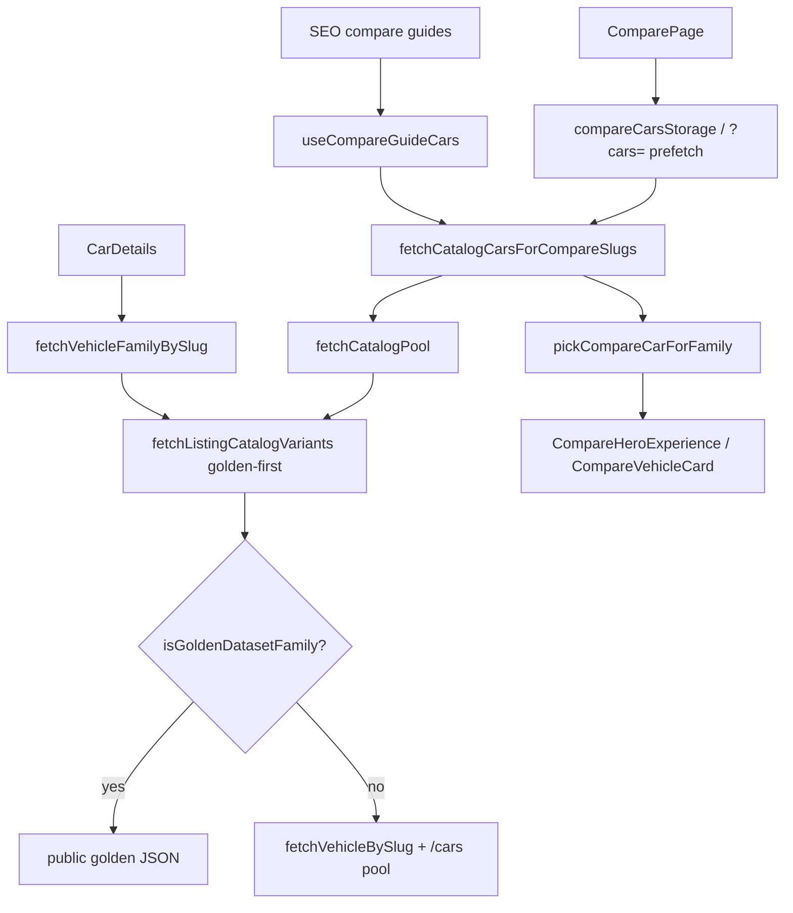

# Catalog Phase 2.5 — Compare Runtime Unification

Generated: 2026-06-11T08:28:21.768Z

## Compare precedence

### Before

- 1. fetchVehicleBySlug per compare slug
- 2. /cars?limit=120 API pool
- 3. pickCompareCarForFamily from API pool
- 4. SEO rankedVehicles stub fallback

### After

- 1. fetchListingCatalogVariants (golden-first, same as listing)
- 2. loadBundledGoldenDatasetFamilyVariants for missing golden families
- 3. fetchVehicleBySlug + API pool only for families ∉ golden manifest
- 4. pickCompareCarForFamily from unified pool
- 5. SEO rankedVehicles stub fallback

## Runtime flow

## Summary

- Vehicles: **25**
- Golden compare resolution: **25**
- API fallback (non-manifest): **0**
- Detail vs compare mismatches: **0**
- Total fleet mismatches: **0**

## Per-vehicle compare resolution

| Family | Compare source | Golden won | API fallback | Detail source | Match |
|--------|----------------|------------|--------------|---------------|-------|
| `tata-nexon-ev` | golden-dataset | yes | no | golden-dataset | yes |
| `tata-punch-ev` | golden-dataset | yes | no | golden-dataset | yes |
| `tata-curvv-ev` | golden-dataset | yes | no | golden-dataset | yes |
| `mg-windsor-ev` | golden-dataset | yes | no | golden-dataset | yes |
| `mahindra-be-6` | golden-dataset | yes | no | golden-dataset | yes |
| `mahindra-xev-9e` | golden-dataset | yes | no | golden-dataset | yes |
| `byd-atto-3` | golden-dataset | yes | no | golden-dataset | yes |
| `hyundai-creta-electric` | golden-dataset | yes | no | golden-dataset | yes |
| `mg-comet-ev` | golden-dataset | yes | no | golden-dataset | yes |
| `hyundai-ioniq-5` | golden-dataset | yes | no | golden-dataset | yes |
| `kia-ev6` | golden-dataset | yes | no | golden-dataset | yes |
| `mahindra-xuv400` | golden-dataset | yes | no | golden-dataset | yes |
| `byd-seal` | golden-dataset | yes | no | golden-dataset | yes |
| `bmw-ix1` | golden-dataset | yes | no | golden-dataset | yes |
| `mercedes-eqa` | golden-dataset | yes | no | golden-dataset | yes |
| `mercedes-eqb` | golden-dataset | yes | no | golden-dataset | yes |
| `volvo-ex40` | golden-dataset | yes | no | golden-dataset | yes |
| `mini-cooper-se` | golden-dataset | yes | no | golden-dataset | yes |
| `citroen-ec3` | golden-dataset | yes | no | golden-dataset | yes |
| `mg-zs-ev` | golden-dataset | yes | no | golden-dataset | yes |
| `maruti-e-vitara` | golden-dataset | yes | no | golden-dataset | yes |
| `hyundai-kona-electric` | golden-dataset | yes | no | golden-dataset | yes |
| `tata-tigor-ev` | golden-dataset | yes | no | golden-dataset | yes |
| `tata-tiago-ev` | golden-dataset | yes | no | golden-dataset | yes |
| `tata-harrier-ev` | golden-dataset | yes | no | golden-dataset | yes |

## Hidden precedence rules (documented, not removed)

### compare-seo-ranked-stub-fallback

- **Location:** `src/utils/compareGuideCatalog.js → mergeRankedWithCatalogCars`
- **Description:** When catalog pool misses a slug, rankedVehicles SEO stub is used (static seo-data fields).
- **Phase 2.5:** Unchanged — last resort after golden + API catalog load.

### compare-storage-hydration

- **Location:** `src/utils/compareCarsStorage.js, ComparePage`
- **Description:** ComparePage may render cars from localStorage without re-fetching resolver.
- **Phase 2.5:** Stale storage possible until user re-opens compare via guide or ?cars= prefetch.

### fetch-vehicle-by-slug-api

- **Location:** `src/utils/vehicleDetailResolver.js → fetchVehicleBySlug`
- **Description:** /cars/slug and catalog API chain for non-golden compare families.
- **Phase 2.5:** Used only when family ∉ golden manifest.

### verified-dossier-loader

- **Location:** `src/data/catalog/verified/buildVerifiedDossierVariants.js`
- **Description:** hasVerifiedDossier for Nexon, Punch, Tiago.
- **Phase 2.5:** Bypassed via fetchListingCatalogVariants golden-first path (compare uses same).

### slug-aliases

- **Location:** `src/utils/vehicleRoutes.js`
- **Description:** Legacy variant slug aliases for Tata families.
- **Phase 2.5:** Applied in detail resolver; compare uses family slug picks.

### pick-default-variant

- **Location:** `src/utils/compareGuideCatalog.js → pickCompareCarForFamily`
- **Description:** Compare card picks default variant via pickDefaultVariantForDetail (same as listing rep).
- **Phase 2.5:** Unchanged selection logic; source pool now golden-aligned.

### apply-compare-display-name

- **Location:** `src/utils/compareGuideCatalog.js → applyCompareDisplayName`
- **Description:** SEO ranked displayName may overlay catalog car name for guides.
- **Phase 2.5:** Display name only; underlying specs from golden/API pool.

