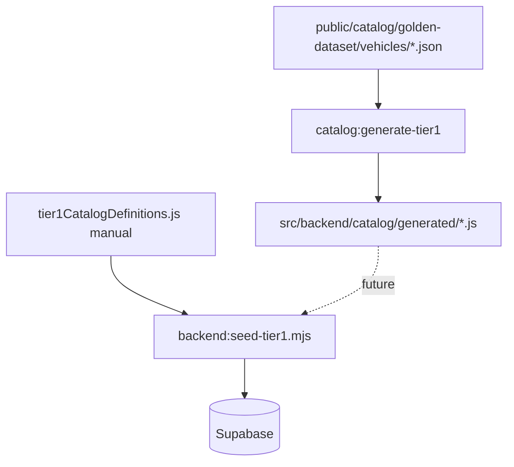

# Catalog Phase 4 — Generated Tier-1 Definitions

Generated: 2026-06-11T08:52:57.027Z

## Summary

- Generated definition modules: **25**
- Vehicles audited: **25**
- Manual tier-1 families: **11**
- Manual/golden aligned comparisons: **4**
- Stale manual tier-1 (skipped): **7**
- Mismatch count: **0**

## Dependency diagram

## Per-vehicle audit

| Family | Manual tier1 | Generated variants | Mismatches | Status |
|--------|--------------|-------------------|------------|--------|
| `tata-nexon-ev` | yes | 13 | 0 | manual-vs-generated-aligned |
| `tata-punch-ev` | yes | 6 | 0 | manual-vs-generated-aligned |
| `tata-curvv-ev` | yes | 3 | 0 | manual-vs-generated-aligned |
| `mg-windsor-ev` | — | 3 | 0 | generated-only |
| `mahindra-be-6` | yes | 3 | 0 | manual-tier1-stale-skipped |
| `mahindra-xev-9e` | yes | 3 | 0 | manual-tier1-stale-skipped |
| `byd-atto-3` | yes | 3 | 0 | manual-tier1-stale-skipped |
| `hyundai-creta-electric` | — | 3 | 0 | generated-only |
| `mg-comet-ev` | yes | 3 | 0 | manual-tier1-stale-skipped |
| `hyundai-ioniq-5` | — | 2 | 0 | generated-only |
| `kia-ev6` | — | 2 | 0 | generated-only |
| `mahindra-xuv400` | yes | 4 | 0 | manual-tier1-stale-skipped |
| `byd-seal` | — | 3 | 0 | generated-only |
| `bmw-ix1` | — | 2 | 0 | generated-only |
| `mercedes-eqa` | — | 2 | 0 | generated-only |
| `mercedes-eqb` | — | 2 | 0 | generated-only |
| `volvo-ex40` | — | 2 | 0 | generated-only |
| `mini-cooper-se` | — | 2 | 0 | generated-only |
| `citroen-ec3` | — | 4 | 0 | generated-only |
| `mg-zs-ev` | yes | 3 | 0 | manual-tier1-stale-skipped |
| `maruti-e-vitara` | — | 3 | 0 | generated-only |
| `hyundai-kona-electric` | yes | 1 | 0 | manual-tier1-stale-skipped |
| `tata-tigor-ev` | — | 4 | 0 | generated-only |
| `tata-tiago-ev` | yes | 4 | 0 | manual-vs-generated-aligned |
| `tata-harrier-ev` | — | 8 | 0 | generated-only |

## Hidden precedence (documented, not removed)

### manual-tier1-catalog-definitions

- **Location:** `src/backend/catalog/tier1CatalogDefinitions.js`
- **Consumers:**
  - backend-seed-tier1.mjs
  - catalogSeedUtils.js
- **Phase 4:** Still used by backend:seed-tier1 — generated modules are parallel only.

### verified-tier1-builders

- **Location:** `tataNexonEvVerified.js / tataPunchEvVerified.js / tataTiagoEvVerified.js`
- **Description:** buildTata*Tier1Definition() feeds manual tier1 for 3 Tata families.
- **Phase 4:** Unchanged — generated tier1 derived from golden JSON instead.

### stale-inline-tier1

- **Location:** `tier1CatalogDefinitions.js inline objects`
- **Description:** 7 non-verified tier1 families have subset/stale specs vs golden (e.g. Kona, MG Comet).
- **Phase 4:** Documented as manualTier1Stale — not generator failures.

