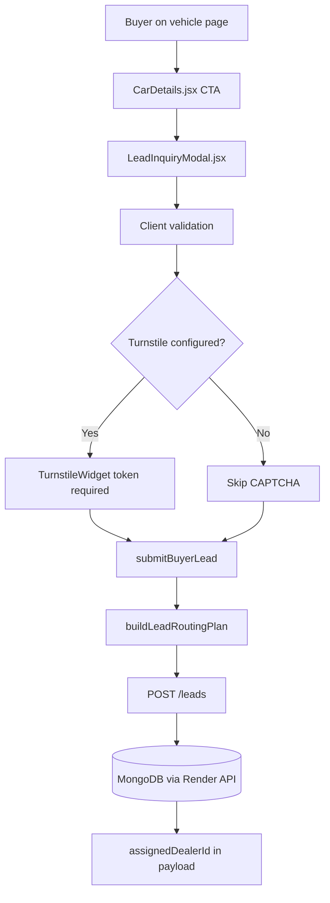

# Lead Journey Certification — MVP-02

**Flow:** Buyer → Vehicle Detail → Lead Form → Validation → CAPTCHA → Submission → Backend → Database → Assignment

---

## Flow Map



---

## Step-by-Step Evidence

### 1. Vehicle detail entry points

**File:** `src/pages/CarDetails.jsx`

Production UI exposes lead CTAs (Playwright snapshot 2026-07-08):

- `Book Test Drive`
- `Get Best Deal`
- `Request Call Back`
- `Get Dealer Assistance`

**Test:** Playwright `vehicle page exposes enquiry entry point` — **PASS**

### 2. Lead modal

**File:** `src/components/LeadInquiryModal.jsx`

| Step | Implementation | Status |
|---|---|---|
| Form open | Props `isOpen`, telemetry `trackLaunchLeadFormOpen` | ✅ |
| Client validation | `validateLeadForm` / `validateTestDriveForm` in `src/utils/validators.js` | ✅ |
| Honeypot | Hidden `company` field — silent drop if filled | ✅ |
| CAPTCHA | `TurnstileWidget` + `turnstileToken`; submit disabled until solved when configured | ✅ Code |
| Submit | `submitBuyerLead()` from `src/services/leadSubmitApi.js` | ✅ |
| Routing metadata | `buildLeadRoutingPlan()` → `assignedDealerId`, `leadStatus`, `leadMetadata.routing` | ✅ |
| Success UX | `setSuccess(true)` + analytics events | ✅ |

**data-testid hooks** (E2E): `lead-inquiry-form`, `lead-name`, `lead-phone`, `lead-state`, `lead-city`, `lead-message`, `lead-turnstile`, `lead-submit`

### 3. Routing (frontend pilot desk)

**File:** `src/utils/leadRouting.js`

Gurgaon example:

```javascript
// city "Gurgaon" → dealerId "pilot-ncr-01", leadStatusTag "routed_city"
```

**Smoke:** `lead:journey:smoke` — **PASS**

### 4. API submission

**Endpoint:** `POST ${API_URL}/leads`  
**Config:** `src/config.js` → production fallback `https://evsavari-api.onrender.com`

**Live probe (2026-07-08):**

| Probe | Result |
|---|---|
| Valid 10-digit phone | HTTP **201**, `leadId` returned |
| Invalid phone `123` | HTTP **400**, validation error |
| Duplicate phone resubmit | HTTP **201**, **new** `leadId`, `merged: false` |

### 5. Database persistence

Frontend does not write leads directly. Persistence is via Render API → MongoDB (backend sibling repo).

**Indirect evidence:** 201 + `leadId` on live POST.

**Frontend mirror:** `src/backend/services/leadService.js` exists for Supabase analytics mirror — **not** dealer source of truth.

### 6. Assignment

Frontend sends `assignedDealerId` and `leadStatus` in POST body (`leadSubmitApi.js`).

Live response: `autoAssigned: false` — backend does not confirm auto-assignment in API response.

---

## Breaks Identified

| # | Break | Severity | Owner | Fix |
|---|---|---|---|---|
| B1 | Duplicate phone creates new lead (`merged: false`) | **Blocker** | Backend | Implement phone dedupe in `zyvev-backend` |
| B2 | Turnstile not verified on production Vercel | **Blocker** | DevOps | Set `VITE_TURNSTILE_SITE_KEY` + backend `TURNSTILE_SECRET_KEY` |
| B3 | `autoAssigned: false` — assignment not confirmed | High | Backend | Verify dealer-user linkage on ingest |
| B4 | No rate limiting on `/leads` in frontend | Medium | Backend | API throttle / IP limit |

---

## Certification Verdict

| Stage | Verdict |
|---|---|
| Buyer UI → form validation | **PASS** |
| CAPTCHA wiring | **PASS** (code); **UNVERIFIED** (prod env) |
| API ingest | **PASS** |
| Duplicate suppression | **FAIL** |
| Assignment proof | **NOT PROVEN** |

**Overall lead journey:** **PARTIAL PASS**
